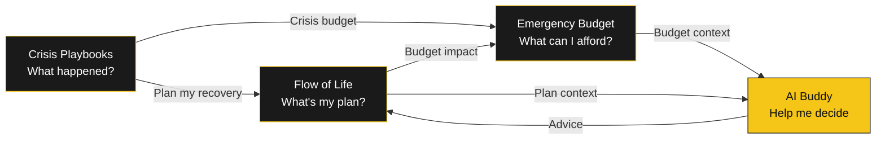
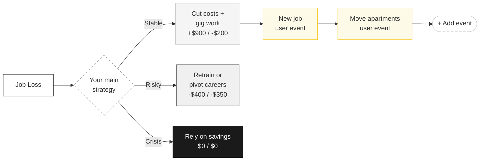
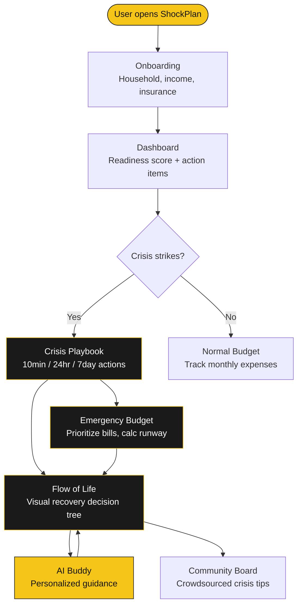
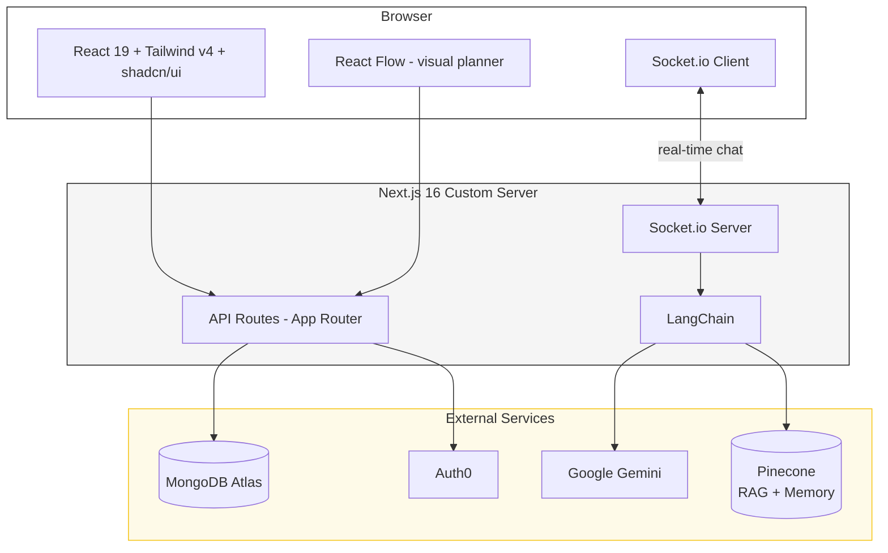
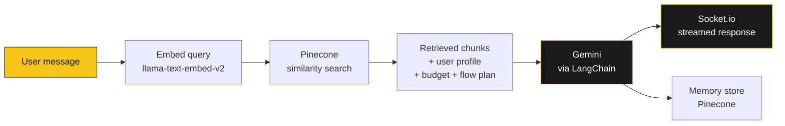

# ShockPlan - Financial Crisis Wellness Tool

**Creed Innovation Hackathon | Financial Wellness Track | ASU**

ShockPlan is a financial crisis preparedness and recovery tool for people who lack access to traditional financial advisors. When life hits hard - a job loss, a medical emergency, an eviction notice - ShockPlan gives you a clear, step-by-step plan to stabilize your finances and recover.

## Target User

**Gig workers, hourly employees, immigrants, and first-generation families** - people living paycheck to paycheck who don't have a financial advisor on speed dial. When a crisis strikes, they need immediate, actionable guidance, not generic financial literacy content.

## What It Does



### Crisis Playbooks
Instant step-by-step action plans for real emergencies (job loss, medical bills, eviction, car accidents, natural disasters). Organized by urgency: what to do in **10 minutes**, **24 hours**, and **7 days**.

### Emergency Budget Mode
A crisis-aware budget tool with slider-based expense tracking and drag-and-drop bill prioritization. Calculates your financial runway: how many weeks your cash will last, what to pay first, and what to defer or cut.

### Flow of Life Planner
A visual decision tree that maps out your recovery path. Branch between strategies, add life events, draw connections, track progress with statuses, and see the projected financial impact of each choice in real time.



### AI Buddy
A context-aware financial assistant powered by Gemini + RAG (Pinecone). It knows your profile, your budget, your crisis, and your recovery plan - so advice is specific, not generic. Includes long-term memory across sessions via Socket.io streaming.

### Community Board
Anonymous, location-aware community where users share what worked during specific crisis types. Upvote helpful tips.

### Readiness Score
A score (0-100) measuring how prepared you are for a financial shock, based on savings, insurance coverage, and crisis awareness.

## User Journey



## Architecture



### AI Buddy RAG Pipeline



## Tech Stack

| Layer | Technology |
|-------|-----------|
| Framework | Next.js 16 (App Router, Turbopack) |
| Frontend | React 19, Tailwind CSS v4, shadcn/ui |
| Flow Visualization | React Flow (`@xyflow/react`) |
| AI | Google Gemini (`@google/generative-ai`) via LangChain |
| RAG / Embeddings | Pinecone + `llama-text-embed-v2` |
| Database | MongoDB Atlas (Mongoose ODM) |
| Auth | Auth0 (`@auth0/nextjs-auth0`) |
| Real-time | Socket.io (AI Buddy streaming) |
| Export | `html-to-image` (Flow PNG export) |

**Total cost: $0** (all services have free tiers)

## Project Structure

```
shockplan/
├── server.ts                    # Custom server (Socket.io + Next.js)
├── src/
│   ├── app/
│   │   ├── page.tsx             # Landing page
│   │   ├── layout.tsx           # Root layout (theme, auth, nav)
│   │   ├── onboarding/          # User profile setup (7 steps)
│   │   ├── dashboard/           # Main dashboard (score, insights, actions)
│   │   ├── crisis/              # Crisis playbooks
│   │   ├── budget/              # Normal + Emergency budget tool
│   │   ├── flow/                # Flow of Life visual planner
│   │   ├── buddy/               # AI Buddy chat
│   │   ├── community/           # Community tips board
│   │   ├── my-data/             # Data export / deletion (privacy)
│   │   ├── sign-in/             # Auth0 sign-in page
│   │   └── api/
│   │       ├── buddy/           # AI chat + Socket.io room endpoints
│   │       ├── budget/          # Budget calculation API
│   │       ├── community/       # Community posts + comments
│   │       ├── flow-plans/      # CRUD for Flow of Life scenarios
│   │       ├── profile/         # User profile API
│   │       ├── score/           # Readiness score API
│   │       └── health/          # Health check endpoint
│   ├── components/
│   │   ├── flow-of-life-planner.tsx   # Main Flow of Life component
│   │   ├── life-path-react-flow.tsx   # React Flow visualization
│   │   ├── budget-table.tsx           # Budget bill table
│   │   ├── app-shell.tsx              # Authenticated layout wrapper
│   │   ├── nav-bar.tsx                # Navigation bar
│   │   ├── dashboard/                 # Dashboard widgets
│   │   ├── landing/                   # Landing page sections
│   │   └── ui/                        # shadcn/ui primitives
│   ├── lib/
│   │   ├── life-path.ts               # Flow of Life core logic + projections
│   │   ├── life-path-templates.ts     # Crisis recovery decision templates
│   │   ├── life-path-flow-layout.ts   # React Flow node/edge layout engine
│   │   ├── budget.ts                  # Budget calculation logic
│   │   ├── score.ts                   # Readiness score calculation
│   │   ├── buddy-chain.ts            # LangChain AI buddy chain
│   │   ├── buddy-chat-handler.ts     # Buddy message handling
│   │   ├── models.ts                  # Mongoose schemas (6 collections)
│   │   ├── mongodb.ts                 # Database connection
│   │   ├── auth0.ts                   # Auth0 client (async lazy-load)
│   │   ├── get-user.ts               # Dual identity: Auth0 userId + deviceId
│   │   ├── local-data.ts             # Client-side localStorage helpers
│   │   └── rag/
│   │       ├── knowledge-chunks.ts   # Financial knowledge base
│   │       ├── retrieve.ts           # RAG retrieval pipeline
│   │       ├── memory-store.ts       # Long-term buddy memory
│   │       └── pinecone-inference-embeddings.ts
│   └── types/
│       └── index.ts                   # All TypeScript interfaces
├── theme.md                           # Design system (monochrome + #F5C518 accent)
├── .env.local.example                 # Environment variable template
└── package.json
```

## Getting Started

### Prerequisites

- **Node.js** 18+
- **npm**

### 1. Clone and install

```bash
git clone https://github.com/reflextoogood/Creed-Innovation-Hackathon.git
cd Creed-Innovation-Hackathon/shockplan
npm install
```

### 2. Set up environment variables

```bash
cp .env.local.example .env.local
```

Open `.env.local` and fill in:

| Variable | Where to get it | Required? |
|----------|----------------|-----------|
| `MONGODB_URI` | [MongoDB Atlas](https://cloud.mongodb.com) - free M0 cluster | Yes |
| `GEMINI_API_KEY` | [Google AI Studio](https://aistudio.google.com) - free, no credit card | Yes |
| `PINECONE_API_KEY` | [Pinecone](https://www.pinecone.io) - free starter plan | Yes |
| `PINECONE_INDEX` | Create in Pinecone dashboard (dimension: 1024) | Yes |
| `AUTH0_DOMAIN` | [Auth0](https://manage.auth0.com) - Regular Web App | Yes |
| `AUTH0_CLIENT_ID` | Auth0 application settings | Yes |
| `AUTH0_CLIENT_SECRET` | Auth0 application settings | Yes |
| `AUTH0_SECRET` | Run: `openssl rand -hex 32` | Yes |
| `PINECONE_MEMORY_INDEX` | Separate Pinecone index for buddy long-term memory | No |

**Auth0 setup** - in your application settings, register:
- Allowed Callback URLs: `http://localhost:3000/auth/callback`
- Allowed Logout URLs: `http://localhost:3000`

### 3. Seed the knowledge base (one-time)

```bash
npm run seed:pinecone
```

Loads financial wellness knowledge into Pinecone for the AI Buddy's RAG pipeline.

### 4. Run the app

```bash
npm run dev
```

Open [http://localhost:3000](http://localhost:3000). The custom server starts both Next.js and Socket.io for real-time AI Buddy chat.

### Other commands

```bash
npm run build          # Production build
npm start              # Production server (Socket.io + Next.js)
npm test               # Run tests (Vitest)
npm run lint           # ESLint
```

### Deploy to Vercel

1. Push to GitHub
2. [vercel.com](https://vercel.com) -> Import project -> Select repo
3. Set root directory to `shockplan`
4. Add all environment variables from the table above
5. Deploy

## Design Philosophy

- **Monochrome + Yellow**: Black/white/gray palette with `#F5C518` as the single accent. No visual clutter.
- **Works without an account**: Full functionality via anonymous device ID. Auth0 login is optional and syncs data across devices.
- **Mobile-first**: All features work on phone screens.
- **Bilingual**: English and Spanish support.

## Hackathon Judging Alignment

| Criteria | How ShockPlan Addresses It |
|----------|---------------------------|
| **Innovation** | Combines crisis playbooks, visual decision trees, emergency budgeting, and RAG-powered AI into one connected pipeline. No existing tool links "what crisis am I in?" to "what's my financial plan?" |
| **Technical Execution** | Full-stack Next.js 16 with real-time AI chat, visual flow editor with drag-and-draw connections, MongoDB persistence, and Pinecone RAG - all functional |
| **Accessibility & Inclusivity** | Built for users without financial literacy - plain language, guided flows, no jargon. Works without an account. Bilingual. Targets gig workers, immigrants, hourly employees |
| **Real-World Impact** | Every feature maps to a real crisis scenario. Emergency budget calculates actual runway in days. Flow of Life tracks real income/expense deltas. Deployable at community centers or benefit portals |
| **Clarity of Communication** | The pipeline tells the story: Crisis hits -> Budget your runway -> Plan your recovery -> AI guides you through it |

## Team

Built by **Team Creed** at the ASU Innovation Hackathon.
